dbplot
================

-   [Connecting to a data source](#connecting-to-a-data-source)
-   [Example](#example)
-   [`ggplot`](#ggplot)
    -   [Histogram](#histogram)
    -   [Raster](#raster)
    -   [Bar Plot](#bar-plot)
    -   [Line plot](#line-plot)
    -   [Boxplot](#boxplot)
-   [Calculation functions](#calculation-functions)
-   [`db_bin()`](#db_bin)
-   [ggvis](#ggvis)

[](https://travis-ci.org/edgararuiz/dbplot)

Leverages `dplyr` to process the calculations of a plot inside a database. This package provides helper functions that abstract the work at three levels:

1.  Provides a `ggplot2` (*highest*)
2.  Outputs a data frame with the calculations (*medium*)
3.  Creates the formula needed to calculate bins (*lowest*)

Connecting to a data source
---------------------------

For more information on how to connect to databases, including Hive, please visit <http://db.rstudio.com>

To use Spark, please visit the `sparklyr` official website: <http://spark.rstudio.com>

Example
-------

In addition to database connections, the functions work with `sparklyr`. A Spark DataFrame will be used for the examples in this README.

``` r
conf <- spark_config()
sc <- spark_connect(master = "local", version = "2.1.0")

spark_flights <- copy_to(sc, nycflights13::flights, "flights")
```

Use `devtools` to install:

``` r
devtools::install_github("edgararuiz/dbplot")
```

`ggplot`
--------

### Histogram

By default `dbplot_histogram()` creates a 30 bin histogram

``` r
spark_flights %>% 
  dbplot_histogram(sched_dep_time)
```


Use `binwidth` to fix the bin size

``` r
spark_flights %>% 
  dbplot_histogram(sched_dep_time, binwidth = 200)
```

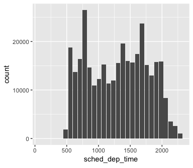

Because it outputs a `ggplot2` object, more customization can be done

``` r
spark_flights %>% 
  dbplot_histogram(sched_dep_time, binwidth = 300) +
  labs(title = "Flights - Scheduled Departure Time") +
  theme_bw()
```

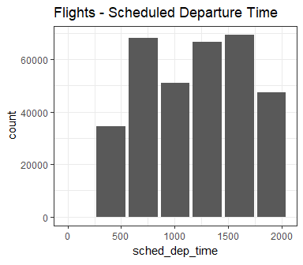

### Raster

To visualize two continuous variables, we typically resort to a Scatter plot. However, this may not be practical when visualizing millions or billions of dots representing the intersections of the two variables. A Raster plot may be a better option, because it concentrates the intersections into squares that are easier to parse visually.

A Raster plot basically does the same as a Histogram. It takes two continuous variables and creates discrete 2-dimensional bins represented as squares in the plot. It then determines either the number of rows inside each square or processes some aggregation, like an average.

-   If no `fill` argument is passed, the default calculation will be count, `n()`

``` r
spark_flights %>%
  filter(!is.na(arr_delay)) %>%
  dbplot_raster(arr_delay, dep_delay) 
```


-   Pass an aggregation formula that can run inside the database

``` r
spark_flights %>%
  filter(!is.na(arr_delay)) %>%
  dbplot_raster(arr_delay, dep_delay, mean(distance)) 
```

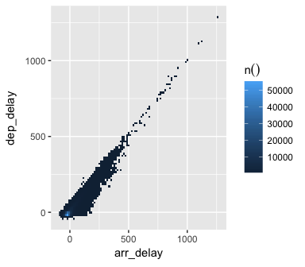

-   Increase or decrease for more, or less, definition. The `resolution` argument controls that, it defaults to 100

``` r
spark_flights %>%
  filter(!is.na(arr_delay)) %>%
  dbplot_raster(arr_delay, dep_delay, mean(distance), resolution = 500)
```

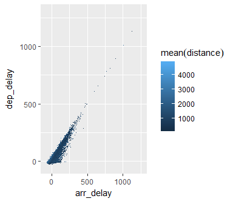

### Bar Plot

-   `dbplot_bar()` defaults to a tally of each value in a discrete variable

``` r
spark_flights %>%
  dbplot_bar(origin)
```

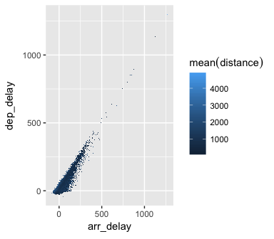

-   Pass a formula that will be operated for each value in the discrete variable

``` r
spark_flights %>%
  dbplot_bar(origin, mean(dep_delay))
```

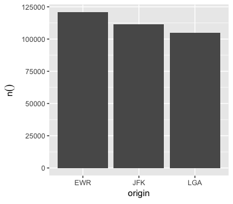

### Line plot

-   `dbplot_line()` defaults to a tally of each value in a discrete variable

``` r
spark_flights %>%
  dbplot_line(month)
```

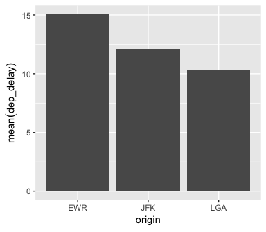

-   Pass a formula that will be operated for each value in the discrete variable

``` r
spark_flights %>%
  dbplot_line(month, mean(dep_delay))
```

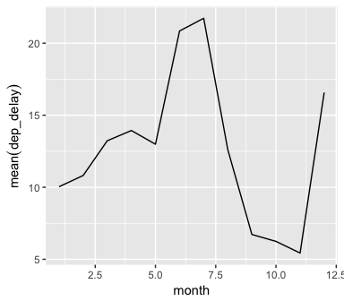

### Boxplot

-   It expect a discrete variable to group by, and a continuous variable to calculate the percentiles and IQR. It doesn't calculate outliers. Currently, this feature works with sparklyr and Hive connections.

``` r
spark_flights %>%
  dbplot_boxplot(origin, dep_delay)
```

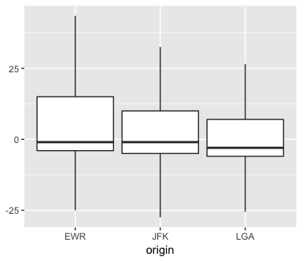

Calculation functions
---------------------

If a more customized plot is needed, the data the underpins the plots can also be accessed:

1.  `db_compute_bins()` - Returns a data frame with the bins and count per bin
2.  `db_compute_count()` - Returns a data frame with the count per discrete value
3.  `db_compute_raster()` - Returns a data frame with the results per x/y intersection
4.  `db_compute_boxplot()` - Returns a data frame with boxplot calculations

``` r
spark_flights %>%
  db_compute_bins(arr_delay)
```

    ## # A tibble: 28 x 2
    ##     arr_delay  count
    ##         <dbl>  <dbl>
    ##  1   4.533333  79784
    ##  2 -40.733333 207999
    ##  3  95.066667   7890
    ##  4  49.800000  19063
    ##  5 819.333333      8
    ##  6 140.333333   3746
    ##  7 321.400000    232
    ##  8 230.866667    921
    ##  9 -86.000000   5325
    ## 10 185.600000   1742
    ## # ... with 18 more rows

The data can be piped to a plot

``` r
spark_flights %>%
  filter(arr_delay < 100 , arr_delay > -50) %>%
  db_compute_bins(arr_delay) %>%
  ggplot() +
  geom_col(aes(arr_delay, count, fill = count))
```

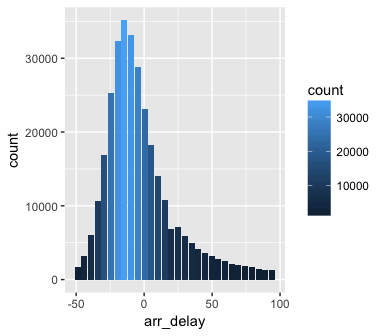

`db_bin()`
----------

Uses 'rlang' to build the formula needed to create the bins of a numeric variable in an un-evaluated fashion. This way, the formula can be then passed inside a dplyr verb.

``` r
db_bin(var)
```

    ## (((max(var) - min(var))/(30)) * ifelse((as.integer(floor(((var) - 
    ##     min(var))/((max(var) - min(var))/(30))))) == (30), (as.integer(floor(((var) - 
    ##     min(var))/((max(var) - min(var))/(30))))) - 1, (as.integer(floor(((var) - 
    ##     min(var))/((max(var) - min(var))/(30))))))) + min(var)

``` r
spark_flights %>%
  group_by(x = !! db_bin(arr_delay)) %>%
  tally
```

    ## # Source:   lazy query [?? x 2]
    ## # Database: spark_connection
    ##             x      n
    ##         <dbl>  <dbl>
    ##  1   4.533333  79784
    ##  2 -40.733333 207999
    ##  3  95.066667   7890
    ##  4  49.800000  19063
    ##  5 819.333333      8
    ##  6 140.333333   3746
    ##  7 321.400000    232
    ##  8 230.866667    921
    ##  9 -86.000000   5325
    ## 10 185.600000   1742
    ## # ... with more rows

``` r
spark_flights %>%
  filter(!is.na(arr_delay)) %>%
  group_by(x = !! db_bin(arr_delay)) %>%
  tally %>%
  collect %>%
  ggplot() +
  geom_col(aes(x, n))
```

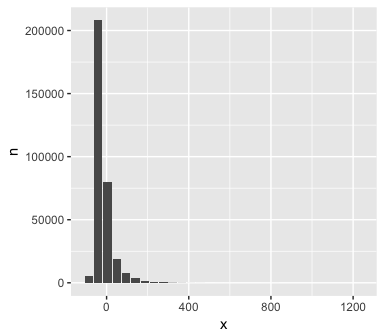

ggvis
-----

`dbplot` now includes an extension to the `ggvis` package. This allows an `tbl_sql` object to be used as the source of the plot without any additional code. Under the hood, `dbplot` adds the proper S3 methods that perform the calculations inside the database, and returns the results in the correct format that `ggvis` expects. To read more and see examples please see visit this link in RPubs: <http://rpubs.com/edgarruiz/dbplot-ggvis>
